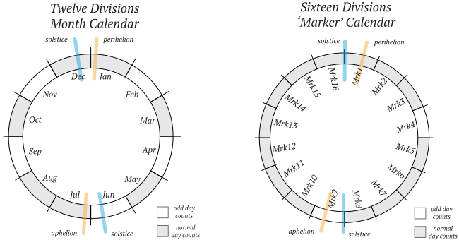

# Glossary

A glossary of Quake Works terms and concepts.

## Markers

### What is a marker?

To be as exact as possible in tracking historical activity, a custom calendaring system was created to place events in time. This custom calendar essentially divides the year into sixteen parts rather than the common twelve months of the civil or Gregorian calendar. This customized calendar is referred to here as the “marker” calendar. Here are the benefits that the marker calendar offers:

**More consistent day counts:** Each marker has 23 days, requiring only two markers in the year to be short on days (the common calendar has five months with abnormal days counts!)

**Better internal comparison:** With the common calendar, two halves of a year can be compared, as well as two quarters, but it’s not easy to go much further. With sixteen parts it is possible to compare down to the base: halves, quarters, eighths, and sixteenths.

**Keyed to astronomy:** There are annual geometries that the Earth makes relative to the Sun, eg. the vertical alignment of the Earth’s rotational axis to it’s orbital axis at the “solstice” positions; the furthest orbital position from the Sun at aphelion. These alignments are slightly transitory and do not occur on a fixed day of the year. And they are not well marked in the common calendar month framework. Even with their transitory nature, the marker calendar makes an attempt at keying the marker periods to these alignments: the northern hemisphere “Winter Solstice” is the zero-point start of the marker timeline.

### Marker Schedule

| ID  |            Date |    Period   |                         Comment                         |
| --- | --------------: | :---------: | :-----------------------------------------------------: |
| Mrk1  | Dec 21 - Jan 12 |   23 days   | [Solstice](https://en.wikipedia.org/wiki/Equinox) & [Perihelion](https://en.wikipedia.org/wiki/Apsis) |
| Mrk2  |  Jan 13 - Feb 4 |   23 days   |                           None                          |
| Mrk3  |  Feb 5 - Feb 27 |   23 days   |                           None                          |
| Mrk4  | Feb 28 - Mar 20 | **21 days** |                     [Equinox](https://en.wikipedia.org/wiki/Equinox) & Leap Year        |
| Mrk5  | Mar 21 - Apr 12 |   23 days   |                           None                          |
| Mrk6  |  Apr 13 - May 5 |   23 days   |                           None                          |
| Mrk7  |  May 6 - May 28 |   23 days   |                           None                          |
| Mrk8  | May 29 - Jun 20 |   23 days   |                           None                          |
| Mrk9  | Jun 21 - Jul 12 | **22 days** |  [Solstice](https://en.wikipedia.org/wiki/Equinox) & [Aphelion](https://en.wikipedia.org/wiki/Apsis)  |
| Mrk10 |  Jul 13 - Aug 4 |   23 days   |                           None                          |
| Mrk11 |  Aug 5 - Aug 27 |   23 days   |                           None                          |
| Mrk12 | Aug 28 - Sep 19 |   23 days   |                           None                          |
| Mrk13 | Sep 20 - Oct 12 |   23 days   |    [Equinox](https://en.wikipedia.org/wiki/Equinox)     |
| Mrk14 |  Oct 13 - Nov 4 |   23 days   |                           None                          |
| Mrk15 |  Nov 5 - Nov 27 |   23 days   |                           None                          |
| Mrk16 | Nov 28 - Dec 20 |   23 days   |                           None                          |

---

## Seismic Pause

### What is the seismic pause?

The seismic pause is the period during the middle of the year when earthquake activity is at it's lowest point, as shown in aggregate historical data. The seismic pause is not specific to a region but seen as a global activity.

---

## True vs Pseudo-Random

### What's the difference between true-random vs pseudo-random?

True-random numbers cannot be reverse-engineered as their creation includes an external mechanism or process that is uncontrolled and unpredictable. Pseudo-random generators are discreet algorithms it is possible (even if highly complex) to have a measure of prediction as to what the output will be. Their output will still be chaotic and approximate "white noise", but is not secret or truly unknowable.